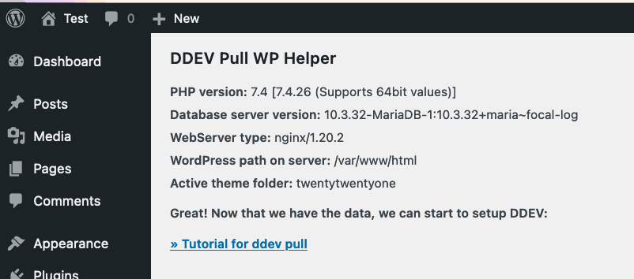

# DDEV pull WP helper plugin

Tiny plugin to help with getting the needed enviroment values for [ddev-pull-wp.mandrasch.eu][https://ddev-pull-wp.mandrasch.eu/].

Status: Work in progress, not ready for production yet. 

⚠️ Please delete the plugin from your production site after you got all the values.

**Download**: https://github.com/mandrasch/ddev-pull-wp-helper-plugin/releases/download/v0.0.1/ddev-pull-wp-helper.zip

## Local development (only for plugin development)

**Local testing**

1. Use wordpress quick start to setup a wp:
https://ddev.readthedocs.io/en/stable/users/cli-usage/#wordpress-quickstart
1. Install theme via dashboard or
`ddev wp plugin install --activate ddev-pull-wp-helper`

Reset:

- `git clean -fdx`
- delete DDEV project: `ddev delete -O`

**Test in WordPress**

1. Archive `ddev-pull-wp-helper` as .zip
1. Upload to WordPress site & activate
1. Check Settings &raquo; DDEV Pull WP Helper
